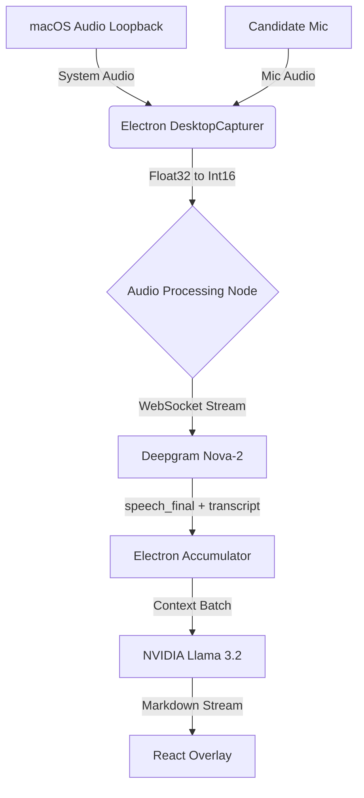
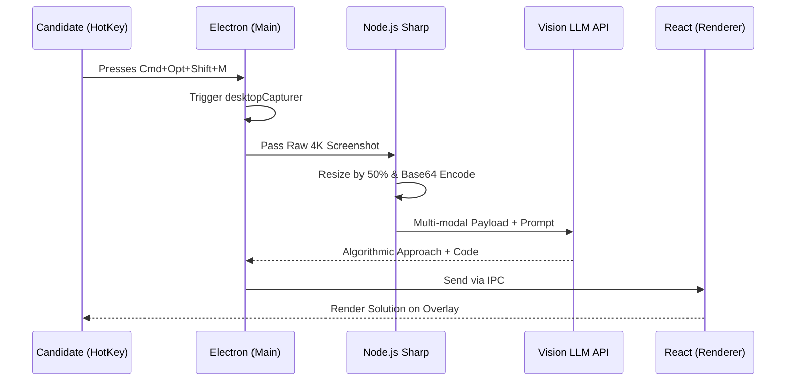

<div align="center">

# 🕵️‍♂️ Interview Helper: The Undetectable macOS Co-Pilot

**A minimal-footprint, low-latency AI desktop overlay built to conquer technical and behavioral interviews entirely undetected.**


</div>

---

## 📑 Table of Contents
- [Introduction](#-introduction)
- [Key Features](#-key-features)
- [Technical Stack](#-technical-stack)
- [Architecture & Design](#-architecture--design)
- [Installation setup](#️-installation-setup)
- [Usage](#-usage)
- [Challenges & Learnings](#-challenges--learnings)
- [Future Enhancements](#-future-enhancements)
- [Demo / Screenshots](#-demo--screenshots)
- [Contributing](#-contributing)
- [License](#-license)
- [Contact](#-contact)

---

## 🚀 Introduction

In an era of increasingly intense remote technical evaluations, candidates often struggle with blanking under pressure rather than a lack of foundational knowledge. **Interview Helper** was conceived to solve this critical gap. 

It is a specialized macOS desktop application acting as a real-time, interactive safety net. Operating exclusively as a translucent, floating window, the system uses dual audio pipelines to transcribe both the interviewer's questions and your responses in real-time. Paired with on-demand screen contextualization using advanced Vision AI, it instantly streams concise, highly accurate algorithmic approaches and code syntax directly into your field of view.

**The defining characteristic? Absolute stealth.** Through low-level macOS API overrides, the application remains mathematically invisible to all modern conference software (Zoom, Google Meet, MS Teams, etc.) and hides entirely from the operating system's Task Manager and Application Dock.

---

## ✨ Key Features

- **🎙️ Real-time Conversational Tracking**: Achieves sub-second latency by aggressively optimizing the transfer of local macOS audio loopback buffers securely to Deepgram's Nova-2 model via WebSocket.
- **🧠 Instant Contextual Responses**: Seamlessly connects transcribed interrogations with NVIDIA Llama 3.2 Vision (configured via OpenAI-compatible APIs) to instantly render markdown-formatted, syntax-highlighted solutions on screen.
- **👁 On-Demand Visual Debugging (The "Panic Button")**: Via a globally registered hotkey, the application securely captures a half-scale state of the candidate's monitor, delivering contextual algorithmic analysis in 10-15 seconds for visual problems like architecture diagrams or whiteboarding.
- **👻 Undetectable System State**:
  - The electron window utilizes native `NSWindowSharingNone` flags, permanently excluding the application buffer from screen and window-sharing APIs.
  - Deploys `LSUIElement` to effectively vanish from the `Cmd+Tab` switcher and "Force Quit" menus.
- **🛡️ "Click-Through" UI State**: At the press of a shortcut, the overlay engages `ignoreMouseEvents`, turning the floating window physically transparent to the cursor so it never inadvertently intercepts a click meant for the underlying IDE.

---

## 🛠️ Technical Stack

- **Frontend (UI/UX)**: `React 19`, `Vite`, `Tailwind CSS`
  - *Why?* Tailwind allows for rapid iteration of a brutalist, typography-first UI that relies heavily on deep legibility when superimposed over dark-mode coding environments. Vite offers uncompromising build speeds.
- **Desktop Environment & System APIs**: `Electron`, `Node.js`
  - *Why?* Electron serves as the bridge. It provides the web-rendering flexibility of Chromium while exposing crucial low-level Node.js modules necessary to interface with macOS WindowServer properties for stealth mechanisms and global hotkey bindings.
- **AI Processing Pipelines**:
  - *Audio*: `Deepgram SDK` (Nova-2) — Unmatched realtime WebSocket performance.
  - *LLM / Text / Vision*: `NVIDIA Llama 3.2 Vision` — Highly capable reasoning model deployed on blazing-fast infrastructure.

---

## 🏗️ Architecture & Design

### 1. The Audio Ingestion Engine



Unlike typical browser-based recorders, this app intercepts lower-level audio buffers via Electron's `desktopCapturer`. 
- It actively splits the audio streams: "System Out" (the interviewer) and "Microphone In" (the user).
- Both streams are serialized from Float32 immediately to Int16 PCM logic to ensure compatibility and low overhead prior to emitting data over WebSockets.
- The system employs a "Question Accumulation" state machine: Text is aggregated until Deepgram signals `speech_final`. Once specific character thresholds and deliberate pauses are verified, the context is bundled and fired to the LLM.

### 2. The Vision API Pipeline



Triggering the vision hotkey initiates a complex synchronous thread:
- A raw, high-resolution snapshot of the principal display is captured.
- To beat network-bound latency overhead resulting from massive payloads, the local Node.js environment processes and downsizes the capture natively before base64 encoding it and appending it to the multimodal API request.

---

## ⚙️ Installation Setup

### Prerequisites
- **macOS** *(Strict requirement due to heavy reliance on macOS-specific WindowServer flags)*
- **Node.js** (v18 or higher)
- **API Keys**: Deepgram and NVIDIA (or compatible OpenAI endpoints).

### 1. Initialize Project Directory
If you have access to the source code, navigate to the extracted directory:
```bash
cd interview-helper
```

### 2. Install Dependencies
```bash
npm install
```

### 3. Environment Variables
Create a `.env` file in the root directory and allocate your API keys:
```env
DEEPGRAM_API_KEY=your_deepgram_api_key
NVIDIA_API_KEY=your_nvidia_api_key
VISION_MODEL=meta/llama-3.2-90b-vision-instruct
VISION_API_URL=https://integrate.api.nvidia.com/v1
```

---

## 🎮 Usage

### Running Locally
To launch both the Vite frontend server and the Electron application instance in tandem:
```bash
npm start
```
*Note: Upon launch, the app behaves as a floating, borderless daemon. It deliberately will not appear in your macOS Dock.*

### ⌨️ Keybindings & Controls

All hotkeys are global and work even when the app window is not focused.

| Hotkey | Action |
|--------|--------|
| `⌘ + ⌥ + ⇧ + M` | **Vision Assist** — captures the full screen and sends it to the AI for analysis |
| `⌘ + ⌥ + ⇧ + H` | **Toggle Mode** — switches between Stealth (transparent/click-through) and Normal mode |
| `⌘ + ⌥ + ⇧ + T` | **Toggle Mic** — toggles your microphone transcription on or off |
| `⌘ + ⌥ + ⇧ + D` | **Dismiss Vision Panel** — clears and hides the active Vision analysis card |
| `⌘ + ⌥ + ⇧ + ↑` | **Scroll Up** — scrolls the transcript log upward |
| `⌘ + ⌥ + ⇧ + ↓` | **Scroll Down** — scrolls the transcript log downward |
| `⌘ + ⌥ + ⇧ + →` | **Font Size +** — increases the transcript text size |
| `⌘ + ⌥ + ⇧ + ←` | **Font Size −** — decreases the transcript text size |

> **Legend:** `⌘` = Command &nbsp;|&nbsp; `⌥` = Option &nbsp;|&nbsp; `⇧` = Shift


---

## 🧠 Challenges & Learnings

Developing an application that dances on the edge of the operating system's security features posed significant engineering hurdles:

1. **Combating LLM Trigger-Happiness**: Initially, real-time transcription meant the LLM fired off partial, nonsensical responses mid-sentence. *Solution:* Built a robust buffering state machine tied closely to Deepgram’s `speech_final` flag combined with heuristic pause-detection to confirm the question had fundamentally concluded.
2. **Vision Payload Latency**: Sending raw 4K Retina display screenshots up the pipe consistently took 25+ seconds, effectively rendering it useless for an interview. *Solution:* Implemented localized image resizing within the Electron main process, slicing the payload size by 75% and reducing round-trip latency to a comfortable 10-12 seconds.
3. **True Stealth Verification**: Verifying the `NSWindowSharingNone` behavior required substantial empirical testing across versions of Zoom, WebEx, Meet, and Teams, utilizing isolated virtual environments to ensure no "black box" rendering errors bled into the candidate's broadcast.

This project drastically expanded my proficiency in OS-level API integration across macOS, asynchronous socket architectures, and LLM-steerage through system-prompts.

---

## 🔮 Future Enhancements

- **Windows Architecture Parity**: Migrating the stealth capabilities to Windows via `SetWindowDisplayAffinity` (WDA_EXCLUDEFROMCAPTURE).
- **Automated Ideation (Local)**: Shifting the LLM processing fully locally via `Ollama` / `LMStudio` to guarantee absolute data privacy and zero network dependency.
- **IDE-Specific Parsing**: Instead of full-screen captures, implementing hooks to only capture specific bounds of recognized IDEs (VS Code, IntelliJ).

---

## 📸 Demo / Screenshots

*(Replace with actual links or embedded gifs of the product in action)*
- [View Live Demo Video](#)
- [Screenshot: Floating Overlay in Action](#)

---

## 🤝 Contributing

Contributions are heavily encouraged! Since this project is tightly bound to macOS APIs, any pull requests expanding this architecture towards Windows or Linux window managers are highly valued.
1. Fork the Project
2. Create your Feature Branch (`git checkout -b feature/AmazingFeature`)
3. Commit your Changes (`git commit -m 'Add some AmazingFeature'`)
4. Push to the Branch (`git push origin feature/AmazingFeature`)
5. Open a Pull Request

---

## 📄 License

Distributed under the GNU General Public License v3.0 (GPLv3). See `LICENSE` for more information.

---

## ✉️ Contact

**Let's connect:**
- **LinkedIn**: [Your Name](https://linkedin.com/in/yourprofile)
- **GitHub**: [@yourusername](https://github.com/yourusername)
- **Email**: you@example.com